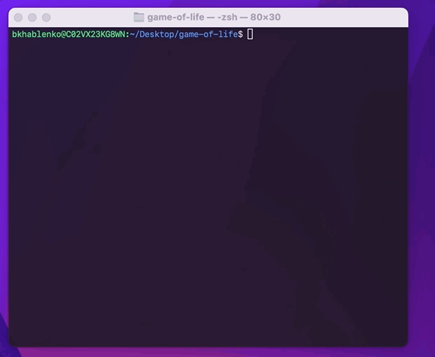

[](https://circleci.com/gh/bkhablenko/game-of-life)

Conway's Game of Life
=====================

## What are the rules?

1. Any live cell with fewer than two live neighbors dies, as if caused by underpopulation.
2. Any live cell with two or three live neighbors lives on to the next generation.
3. Any live cell with more than three live neighbors dies, as if by overpopulation.
4. Any dead cell with exactly three live neighbors becomes a live cell, as if by reproduction.

These rules determine the evolution of the cells in the game.
The game is played on a grid of cells, and each cell can be either alive or dead.
The rules are applied simultaneously to all cells in each generation, creating a new generation based on the current state of the cells.

## How to run

```bash
./gradlew clean build -x test && docker compose run --build app
```

You should see something like this:



## License

This project is licensed under the terms of the MIT license. See the [LICENSE](LICENSE) file for details.
